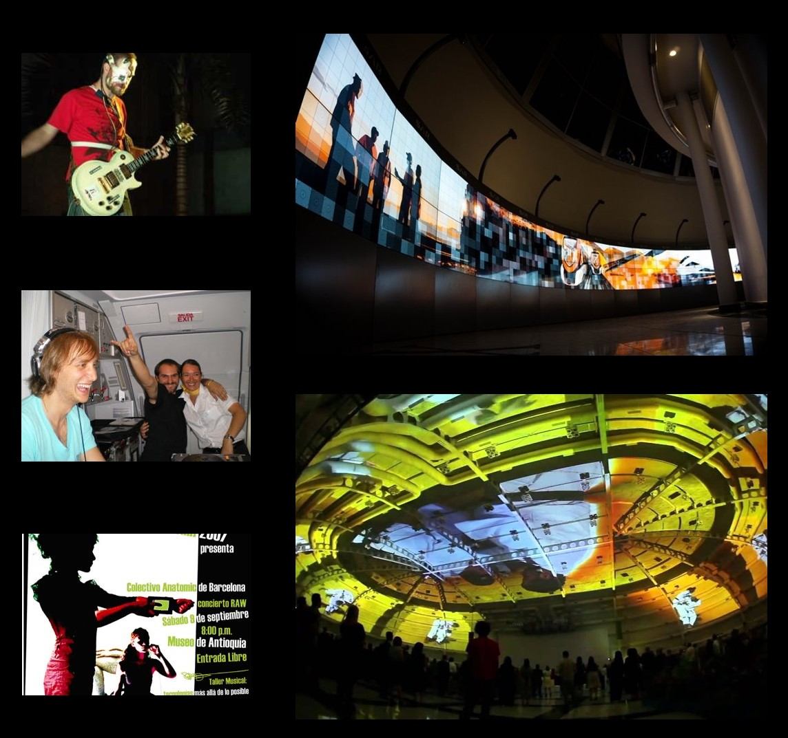

# Juan Coll

Nacido en 1978, de padre físico teórico y madre asistente social, con estudios entre París y Barcelona de Matemática, Informática, Arte \(Pintura\) y Música. ​

## Destacados

### 2002-2005 - Profesor de física en la escuela de ingeniería La Salle \(Barcelona\)​

### **2003-2007** - Compañía de teatro de arte y tecnología – El colectivo Anatomic.

* Música por PDA's \(3 años antes de que saliera el iPhone\)
* El ojo como distorsión de la guitarra.

### **2004 – 2017** Fundador o co-fundador de varias Empresas de software y contenidos

**Empresas**

* Emotique S.L. 
* MediaFlow Software S.L.
* Nexcommunity S.L.
* Nexcode S.L.

**Proyectos importantes**

*  Primera discoteca en un avión comercial . \([ver más](concept-a/emotique-s.l./sub-b.md)\)
*  Proyección de la Cúpula del World Trade Center Brasil ****\(80 x 50 metros\). [link](https://www.youtube.com/watch?v=rlVgLma0hws)
*  Video Wall Interactivo mas grade del Mundo. [video](https://vimeo.com/291501766) 
*  Nexwarp, software de mapping hackeando el s.o. \([ver más](programming/nexwarp.md)\)

### **2017 –  actual** - Shine

Nodall Systems es una startup que se crea junto al group Hotelero español Hotusa S.A. \(70%\),  dedicada a la conceptualización y creación del producto Shine, un sistema audiovisual que transforma las habitaciones en SMART ROOMS . \([ver más](concept-a/nodall-systems-hotusa.md), o ir a la [web](http://www.shinesmartroom.com/)\)

