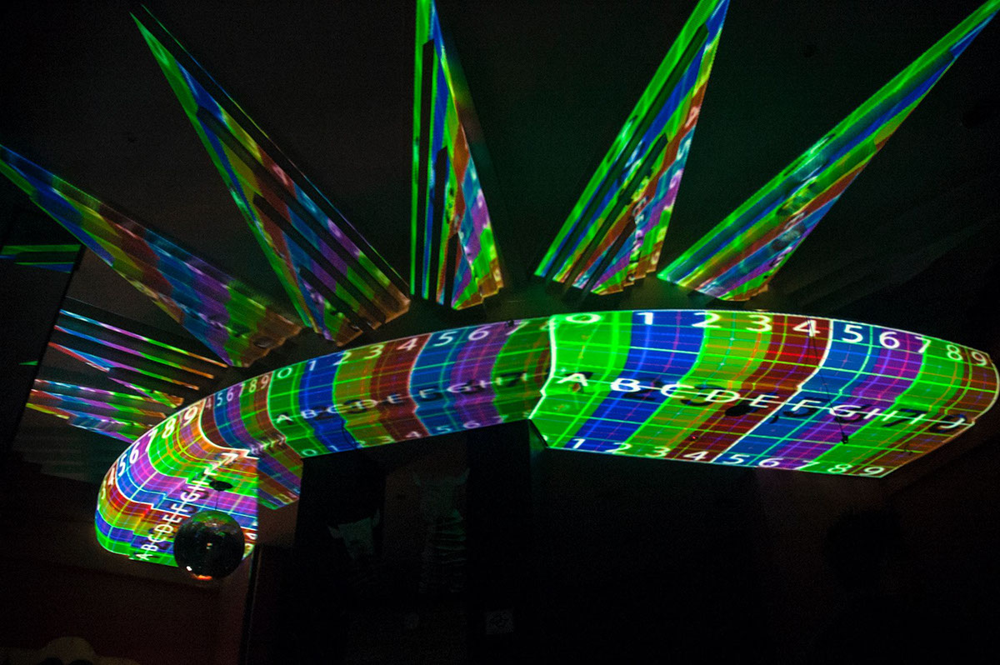

# mediaflow software

MediaFlow ha sido nuestra solución de mapping, multi proyector, multiordenador para grandes formatos y eventos de todos tipo \(ver trabajos de las empresas [MediaFlow Events](../timeline/empresas/mediaflow-events-sl/works.md) y [Nexcommunity](../timeline/empresas/nexcommunity-sl/works.md)\). Ha llegado a gestionar más de 20 ordenadores con algunos de más de 6 salidas.

Se ha llegado a trabajar con resoluciones de 52 000 Píxeles.



