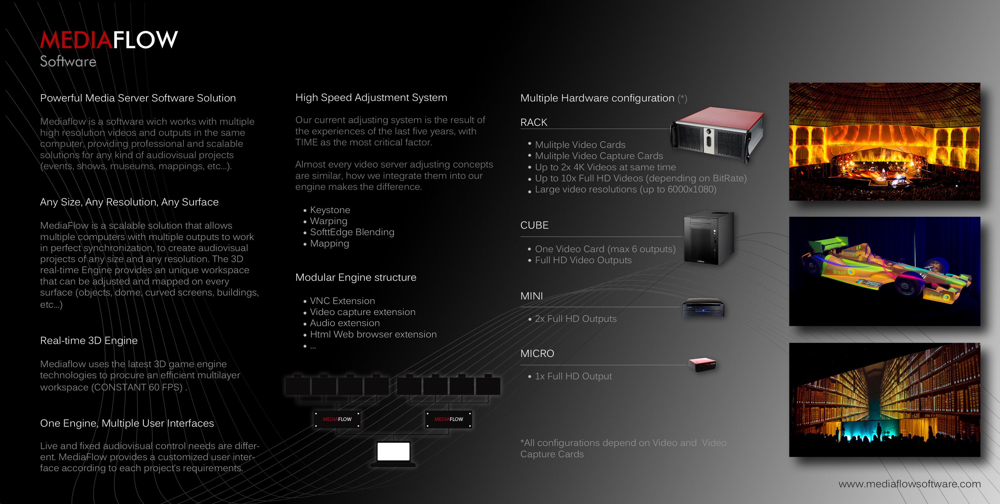
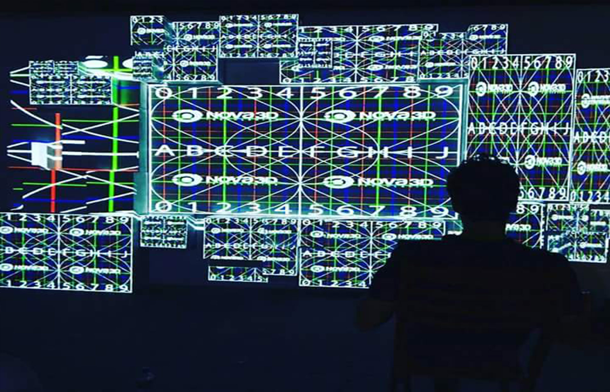
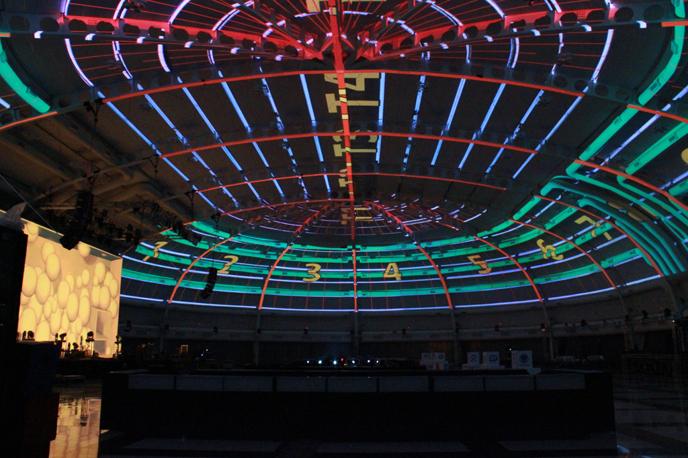

# mediaflow software

MediaFlow a sido nuestra solucion de mapping, multi proyector, multiordenador para grandes formatos y Eventos de todos tipo \(ver trabajos de las empresas [MediaFlow Events](../timeline/mediaflow-events-sl/works.md) y [Nexcommunity](../timeline/nexcommunity-sl/works.md)\). A llegado a gestionar mas de 20 ordenadores con algunos de mas de 6 salidas.

Se han llegado a trabajar con resoluciones de 52 000 Pixeles.



