# shine

## Overview

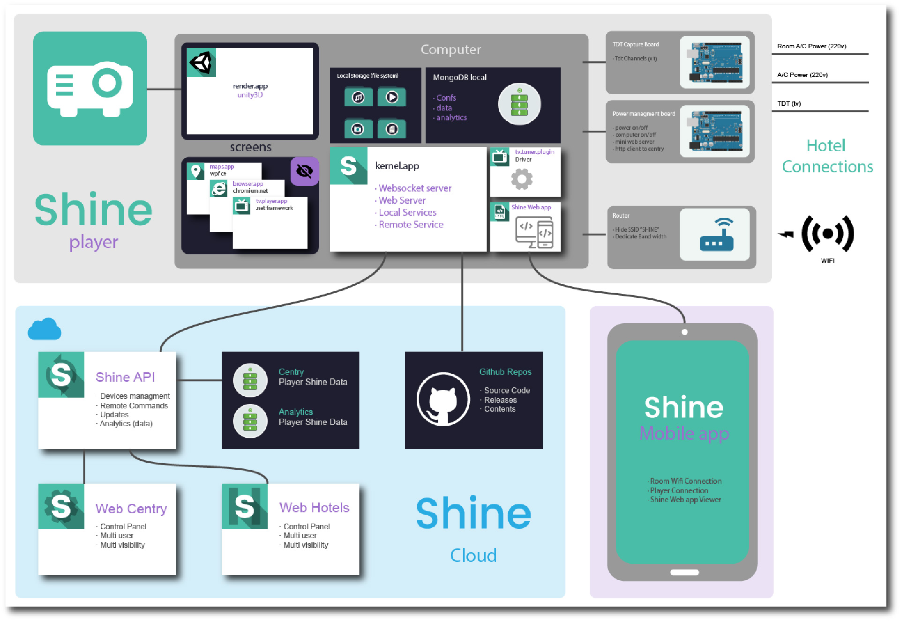

### External services

| name | description |
| :--- | :--- |
| office 365 | all team accounts |
| github | source code repositories \(nodall user\) |
| azure | Servers, Storage |
| azure devops | Pipelines, Project Management and private npm and nuget package manager |
| mongo Atlas | data base |

### Development Tools

| name | description |
| :--- | :--- |
| [vscode](https://code.visualstudio.com/)  | node and html develpment\) |
| [platformio](https://platformio.org/)  | ioboard development |
| [visual studio Comunnity 2019](https://visualstudio.microsoft.com/es/vs/)  | all c\# code |
| [Azure Devops](https://dev.azure.com/nodall-dev/) | Pipelines and Management |
| [AppCenter](https://appcenter.ms/apps)  | Mobile App |

### Technologies

* javascript
  * [typescript](https://www.typescriptlang.org/) 
  * [vue](https://vuejs.org/) 
  * [vuetify](https://vuetifyjs.com/es-MX/) 
  * [mongodb](https://github.com/mongodb/node-mongodb-native) 
  * [nestjs](https://nestjs.com/)  \(Api server\)
  * [socket.io](https://socket.io/) 
  * [Capacitor](https://capacitor.ionicframework.com/)  \(Mobile app development\)
* c\#
  * [UWP Apps \(maps.app\)](https://docs.microsoft.com/es-es/windows/uwp/get-started/universal-application-platform-guide) 
  * [Windows.Form \(tv.player.app, browser.app\)](https://docs.microsoft.com/es-es/dotnet/framework/winforms/) 
  * [WPF \(Kernel.app, update.app\)](https://docs.microsoft.com/es-es/visualstudio/designers/getting-started-with-wpf?view=vs-2019) 
  * [CEFSharp](https://cefsharp.github.io/) 
* [Unity 3D \(render.app\)](https://unity.com/es) 
* c++ / Arduino \(ioboard\)

## devops

#### Pipelines \([https://dev.azure.com/nodall-dev/Shine/\_build](https://dev.azure.com/nodall-dev/Shine/_build)\)

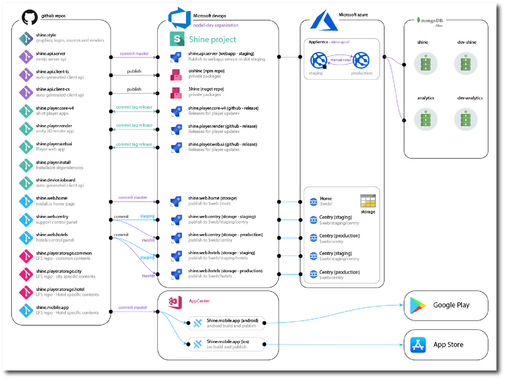

#### Management Projects \([https://dev.azure.com/nodall-dev/](https://dev.azure.com/nodall-dev/)\)

#### Deploy Steps

**Server**

Repository have 2 branches

* develop: all development and test done here
* master: only to merge the develop branches when ready

Publish to master branch launch a pipeline and install server api in staging webservice  
To swap to production webservice use azure portal and do manualy \(it take seconds\)

**Web application**

Web aplications are alocated in Azure Blob storage service in $web folder. We have 3 branch

* develop: to develop and execute in your local computer
* staging: publish to a staging slot in azure storage. folder is $web/staging/\[appname\] Test online the new features
* master: publish to the production folder $web/\[appname\]

**Player Softwares**

All players software updates from Github releases.  
Release are named with \[tag\]-\[version\], where version is [https://semver.org/](https://semver.org/)   
examples: demo-0.0.1, release-12.0.0, dev-0.0.1, etc...

steps tu publish are

* use develop branch until you finish the new version
* merge into master
* execute script script/release.js \(in master branch\)
  * publish tag \(Create release\)
  * execute pipeline
  * zip ouput and upload to github release

## The player

### Workspace

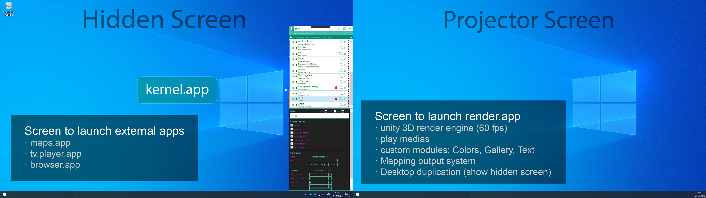

#### File System

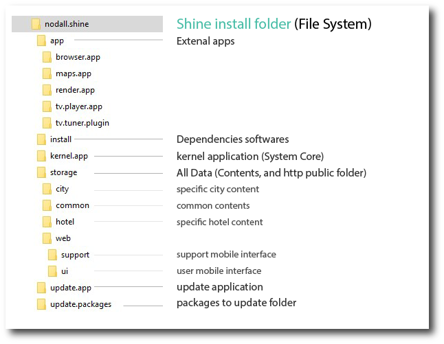

#### Kernel.App

Is the core of the system. All funcionalities are encapsulated in independent Threaded services. It give more control, modularity and extensibility to the system. All service and external application or Mobile app are connected each others with the websocket realtime custom protocol \(see further in the document\) .

#### Render.App

The render app is a full screen mode Unity 3D engine with multiple features

* play any medias
* play custom developments
  * color: grafient color full screen feature. Transform screen in a smart light
  * gallery: lets navigate throw fotos
  * Text: hight level Text engine for Smart mode communication between the user and Shine
  * Mapping engine: The output is a full mapping system, with corder keystone, beziers distorsion, and texture mapping.
  * Desktop duplication: this is the main important features for the extensibility of the system.

#### Extension.App

* Maps.app: Basic custom maps 3D application based on Bing maps. Developped in UWP c\# technology.
* tv.player.app: A windows Form application than embed the VLC player to Stream TV Channels from MediaPortal.
* browser.app: A CEFSharp integration to have a full Google Chrome Web Browser. Used for games application.

### kernel.app

#### Elements

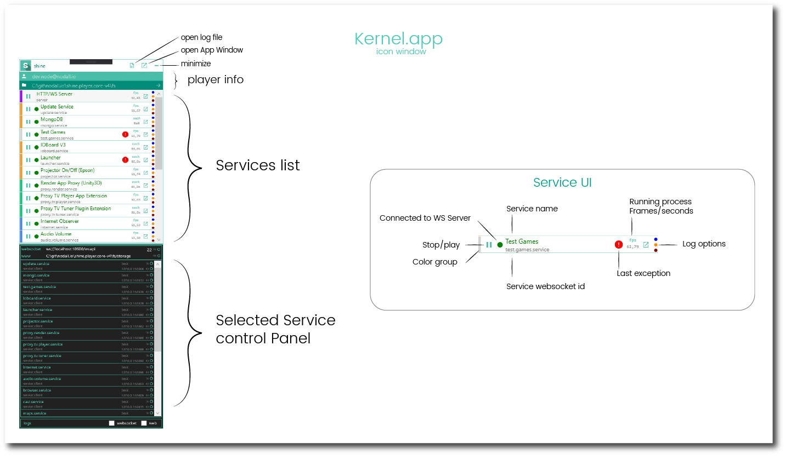

#### Services

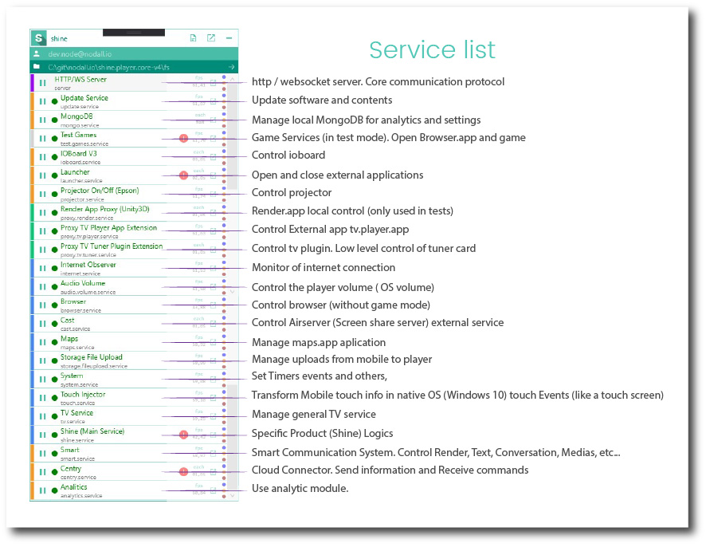

#### Communication protocols

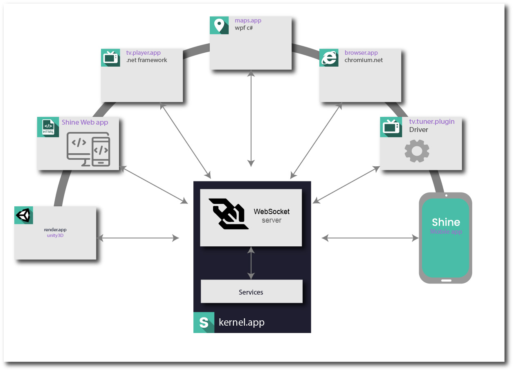

Custom protocol over Websocket

* Publish/Subscribe protocol
* Request/Response protocol
* Authentication protocol
  * none 
  * basic \( server filtering \(ip for example\) 
  * auth \(Request -&gt; verification -&gt; confirmation\)

## Installer

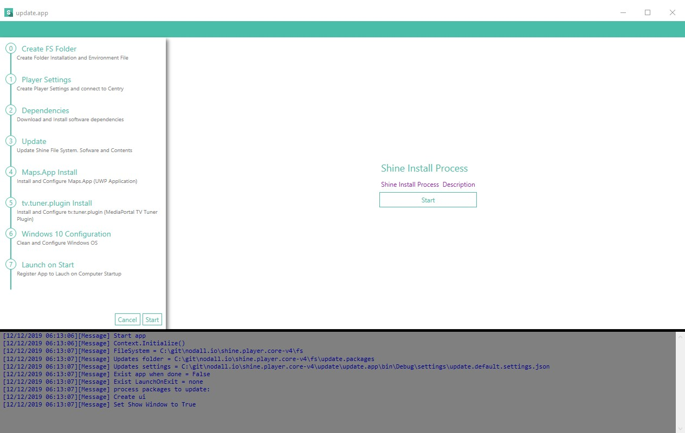

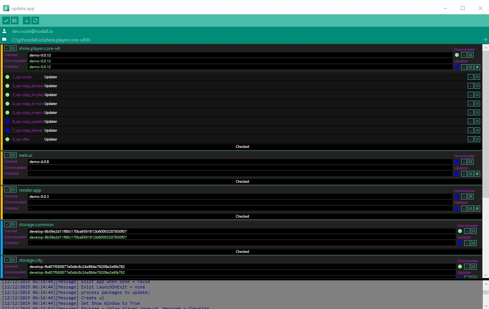

## Centry - control panel

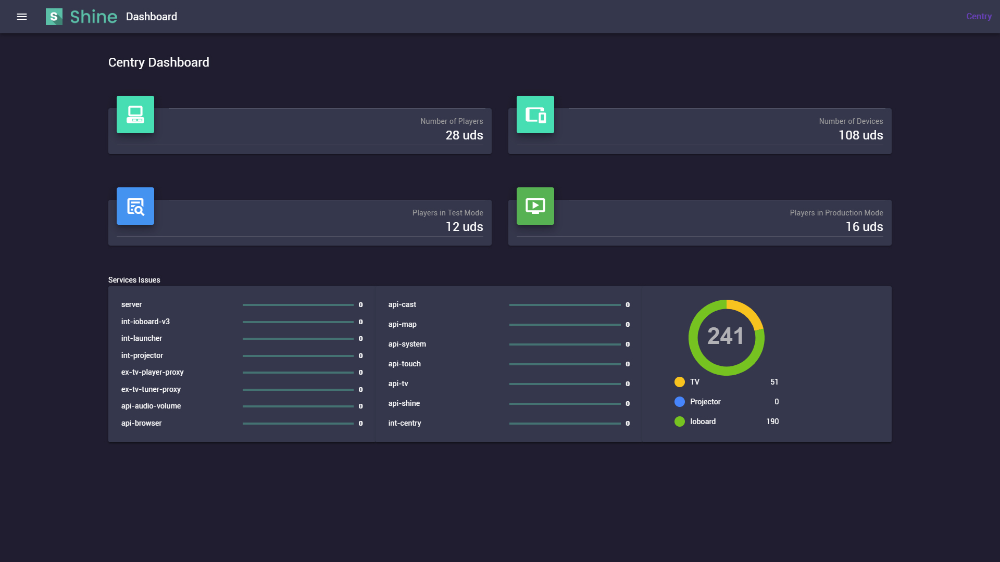

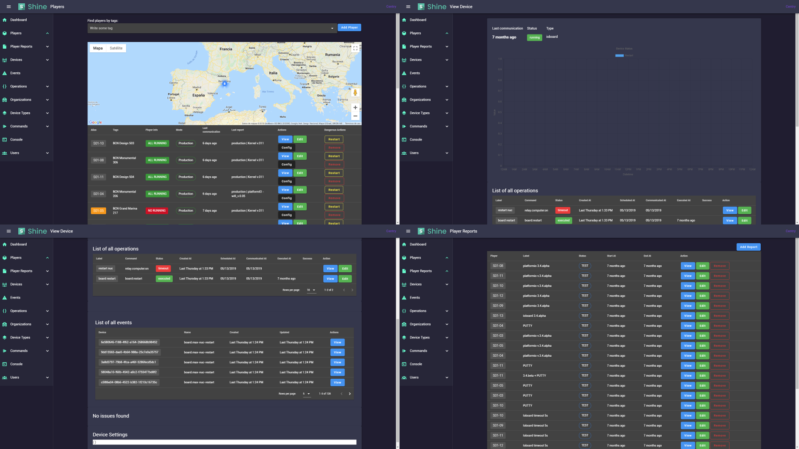

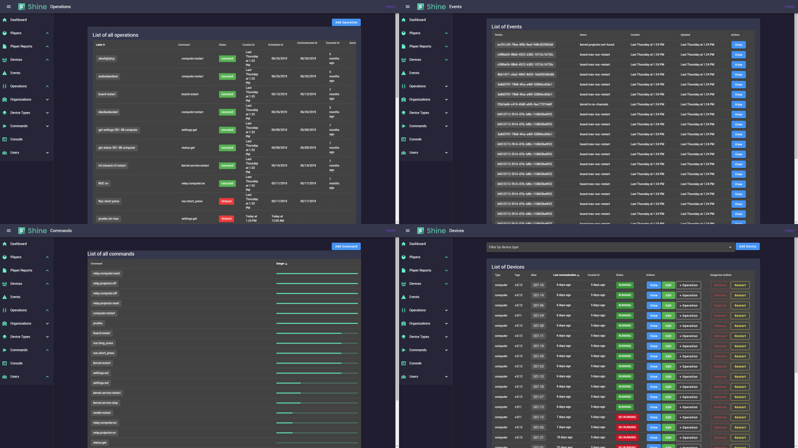

## Update System

In shine we have 2 type of updates

* Software \(new versions\)
* Content \(new media or configuration files\)

### Software

The software update is bases on Github releases

#### Release Updatable Repositories

* shine.player.core-v4
* shine.player.render
* shine.player.web.ui

### Contents

The software update is bases on Git Branches

#### Shine Contents Repositories

* shine.player.storage.common
* shine.player.storage.city
* shine.player.storage.hotel

