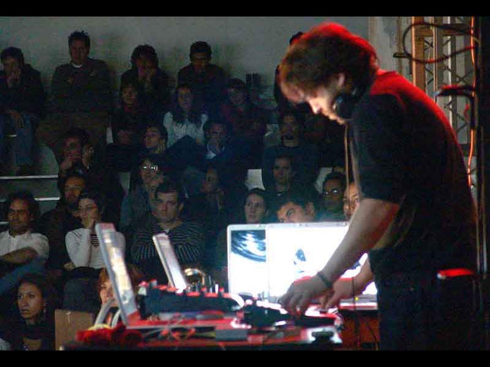
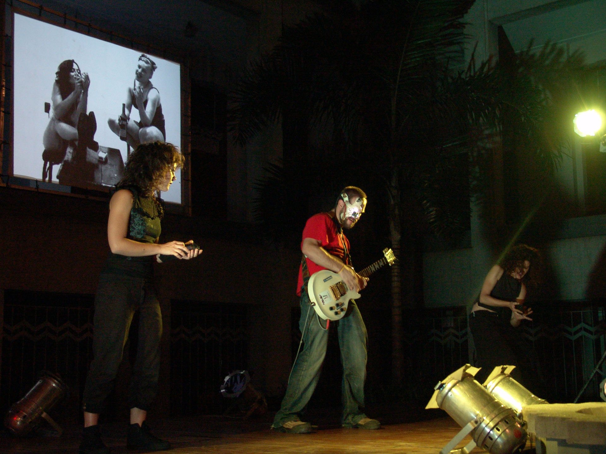

# R.A.W









## Medias

### Trailer



### Entrevistas





### Audios











## 2005

* POZEGA, Croacia, Gradsko kazaliste 
* TORTOSA, España, Internacional Festival “EntreCulturas” 
* BARCELONA, España, Iglesia “La Ostia” 
* BARCELONA, España, Can Golferichs SABADELL, España, 30 Nits Festival

### Iglesia "La Ostia", Barcelona







        

## 2006

### Folleto

### Barcelona







### \(Junio\) Barcelona, Festival Sonar



  

### \(Agosto\) Parque Cultural Ex-Cárcel, Valparaíso, Chile

Alain Wergifosse, ruidista profesional, compone la atmósfera acústica. Las performers e intérpretes de los instrumentos interactivos son Caro Pastor y Marta Pelegrina. Joan Coll toca la guitarra eléctrica. La iluminación y las fotos son de Jordi Torra.

### \(Septiembre\) Colombia

Las performers e intérpretes de los instrumentos interactivos fueron Caro Pastor y Marta Pelegrina. Joan Coll tocó la guitarra eléctrica. Álvaro Uña manipuló los ordenadores y tocó la guitarra eléctrica virtual. Más de cuatro mil espectadores presenciaron RAW.

Junto a las funciones impartieron talleres y conferencias.

#### Bogota

   

#### Medellin

                             

#### Extras

   

### \(Septiembre\) Australia - Sydney, Canberra, Newcastle

Las performers e intérpretes de los instrumentos interactivos fueron Caro Pastor y Marta Pelegrina. Joan Coll tocó la guitarra eléctrica y la guitarra eléctrica virtual. El ruidista Alain Wergifosse manipuló los ordenadores.

RAW se ha presentado en Barcelona, Tortosa, Pozega \(Croacia\), Koudougou \(Burkina Faso\), Torino \(Italia\), Santiago de Chile y Valparaíso \(Chile\), Bogotá, Medellín, Cali y Manizales \(Colombia\).

|  |  |
| :--- | :--- |
| Caro ante la Ópera de Sidney | Marta, Joan \(con la banda de gala de los Tunos de Sants\), Alain \(con extraños objetos en sus manos\), Caro, Alister y su mujer \(nuestros anfitriones\). |







### \(Octubre\) Brasil

#### Festival Riocenacontemporanea. Rio de Janeiro.

RAW se estrenó en mayo de 2005 en Barcelona. Joan Coll y Álvaro Uña idearon la dramaturgia y la dirección.

Las performers e intérpretes de los instrumentos interactivos fueron Caro Pastor y Marta Pelegrina. Joan Coll tocó la guitarra eléctrica y la guitarra eléctrica virtual. Álvaro Uña manipuló los ordenadores y la guitarra eléctrica virtual.

#### MobileFest. Teatro da Federaçao do Comercio FECOM. Sao Paolo

Junto a las funciones, completa la gira internacional los talleres y conferencias que los miembros del Colectivo Anatomic imparten en teatros y universidades. En Sao Paolo participarón en el MobileFest, festival de tecnología móvil.

### \(Noviembre\) Madrid

El jueves 2 de noviembre el Colectivo Anatomic actuó en el CHESTERFIELD CAFE \(c/Serrano Jover 5, esquina Alberto Aguilera\).

### \(Noviembre\) Perú

El Colectivo Anatomic regresó de Perú. Han trabajado con el Centro Fundación Telefónica y el Centro Cultural de España en Lima.

EN EL CENTRO FUNDACION TELEFONICA LIMA realizaron Talleres de Arte y Nuevas Tecnologías, y la Conferencia-Concierto. Presentaron RAW en el Auditorio Telefonica. EN EL CENTRO CULTURAL DE ESPAÑA EN LIMA mostraron la Conferencia-Concierto y celebraron encuentros con artistas locales.

  

### \(Diciembre\) Concierto Apolo

Fiesta final de la GiraInternacional2006.

. El 14 de diciembre, tras sus actuaciones en Australia, Brasil, Colombia, Chile, Perú, Italia, Holanda, Francia, Croacia y Burkina Faso, el Colectivo Anatomic presentó en la Sala Apolo el espectáculo musical multimedia e interactivo RAW.







## 2007

### \(Abril\) Marruecos \(Tetuan, Casablanca y Tager\)

     

