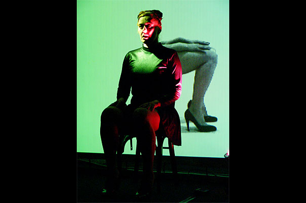

# R.A.W

## Medias

### Trailer



### Entrevistas





## 2005

* POZEGA, Croacia, Gradsko kazaliste 
* TORTOSA, España, Internacional Festival “EntreCulturas” 
* BARCELONA, España, Iglesia “La Ostia” 
* BARCELONA, España, Can Golferichs SABADELL, España, 30 Nits Festival

### fotos - \(Iglesia "La Ostia", Barcelona\)

        

## 2006 \(Junio\) Barcelona, Festival Sonar

### Entrevista Allain Vergifosse



### fotos

  

## 2006  \(Agosto\) Parque Cultural Ex-Cárcel, Valparaíso, Chile

Alain Wergifosse, ruidista profesional, compone la atmósfera acústica. Las performers e intérpretes de los instrumentos interactivos son Caro Pastor y Marta Pelegrina. Joan Coll toca la guitarra eléctrica. La iluminación y las fotos son de Jordi Torra.

    

## 2006 \(Septiembre\) Colombia

Las performers e intérpretes de los instrumentos interactivos fueron Caro Pastor y Marta Pelegrina. Joan Coll tocó la guitarra eléctrica. Álvaro Uña manipuló los ordenadores y tocó la guitarra eléctrica virtual. Más de cuatro mil espectadores presenciaron RAW.

Junto a las funciones impartieron talleres y conferencias.

### Bogota

### Medellin

### Extras

## 2006 \(Septiembre\) Australia - Sydney, Canberra, Newcastle

Las performers e intérpretes de los instrumentos interactivos fueron Caro Pastor y Marta Pelegrina. Joan Coll tocó la guitarra eléctrica y la guitarra eléctrica virtual. El ruidista Alain Wergifosse manipuló los ordenadores.  

RAW se ha presentado en Barcelona, Tortosa, Pozega \(Croacia\), Koudougou \(Burkina Faso\), Torino \(Italia\), Santiago de Chile y Valparaíso \(Chile\), Bogotá, Medellín, Cali y Manizales \(Colombia\).
|  | |
|--|--|
| Caro ante la Ópera de Sidney |Marta, Joan (con la banda de gala de los Tunos de Sants), Alain (con extraños objetos en sus manos), Caro, Alister y su mujer (nuestros anfitriones).  |

## 2006 \(Diciembre\) Concierto Apolo









## 2007

