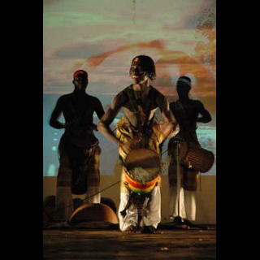
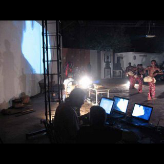
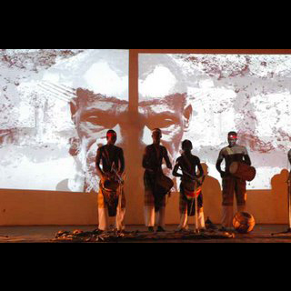
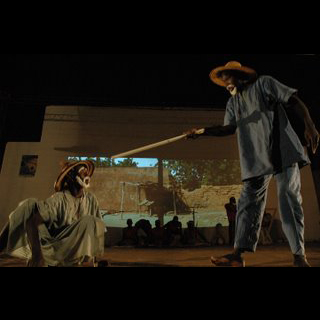
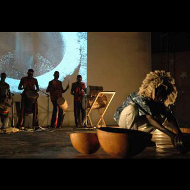

# FASO 05 - workshop

El pasado mes de diciembre de 2005 viajamos a la región de Koudougou, en Burkina Faso, para colaborar con la asociación Laafi en la organización del festival FASO05.

Después de meses de trabajo previo, el Colectivo Anatomic llegó a Koudougou para preparar todo lo necesario para la presentación de una obra de teatro que un grupo de jóvenes venía trabajando y relacionar su proyecto con nuestra experiencia en trabajar en nuevas tecnologías y artes escénicas. De aquí surgió un proyecto independiente y este grupo ya está realizando funciones de la obra por su país. En esas fechas, el Colectivo Anatomic también presentó su última creación RAW.

Formaron parte de este proyecto: Alvaro Uña, Joan Coll, Alain Wergifosse, Albert Faust, Xavier Vaqué, Juan Gilarbiol, Borja Castellano, Empar Rosselló, Esther Martinez.

La página de Laafi es www.laafi.com. Seguimos trabajando con ellos por la continuación del proyecto y para organizar un nuevo festival en 2006-2007. Si quereis recibir más información acerca del proyecto, no dudéis en contactar con nosotros. 



## Vídeo



## Fotos

