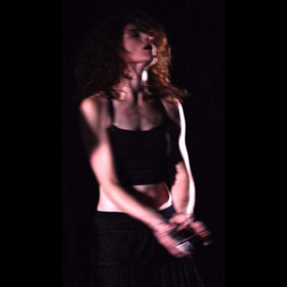
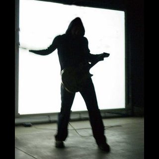

# R.A.W - espectáculo

## Trailers

## 2005

* POZEGA, Croacia, Gradsko kazaliste 
* TORTOSA, España, Internacional Festival “EntreCulturas” 
* BARCELONA, España, Iglesia “La Ostia” 
* BARCELONA, España, Can Golferichs SABADELL, España, 30 Nits Festival

## 2006  Parque Cultural Ex-Cárcel, Valparaíso, Chile

Alain Wergifosse, ruidista profesional, compone la atmósfera acústica. Las performers e intérpretes de los instrumentos interactivos son Caro Pastor y Marta Pelegrina. Joan Coll toca la guitarra eléctrica. La iluminación y las fotos son de Jordi Torra.

    

## 2007

