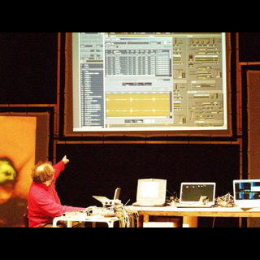
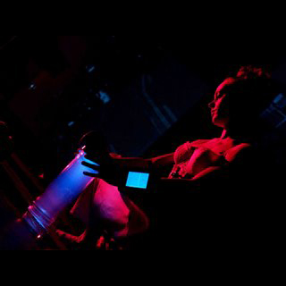
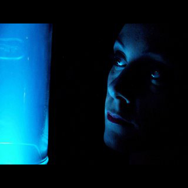
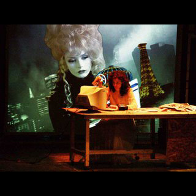
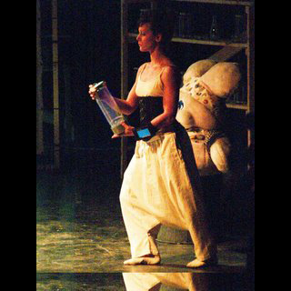
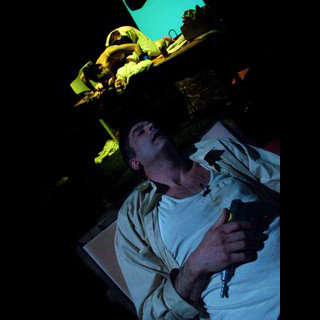

# Rotten - espectáculo

## 2005

* BARCELONA, España, Mercat de les Flors 
* PARIS, Francia, La Villette, Emergentes Festival 
* AMSTERDAM. Holanda, 
* Robodock Festival BARCELONA, España, L’Antic Teatre 
* LLEIDA, ESPAÑA, Teatre Municipal de L’Escorxador

## 2006 - Santiago de Chile, Julio

Centro Cultural Matucana100, Santiago de Chile. Julio 2006. ROTTEN se presentó en el Centro Cultural Matucana100 de Santiago de Chile en julio de 2006.

Es la historia de un hombre que ya no distingue su realidad cotidiana de sus fantasías. Espera el regreso de su hija, mientras convive en su hogar con la personalización de la Consciencia y de la Inconsciencia.

ROTTEN \(en inglés, "podrido"\) se estrenó en el Mercat de les Flors de Barcelona en febrero de 2005. El espectáculo ha evolucionado hasta adquirir su forma actual.

Las actrices Caro Pastor y Marta Pelegrina, la Inconsciencia y la Consciencia respectivamente, manipulan la imagen y el sonido con las PDA que llevan en la muñeca. Joan Simó interpreta al hombre. Alain Wergifosse concibe la música. Las imágenes proyectadas las realizó Nicolás García. La iluminación y las fotos están a cargo de Jordi Torra. Jorge Raedó revisó la dramaturgia, a partir de la dramaturgia y la dirección original de Joan Coll y Álvaro Uña.

El Colectivo Anatomic ha presentado ROTTEN en Barcelona, París, Amsterdam, Burgos, Lleida y Santiago de Chile.

