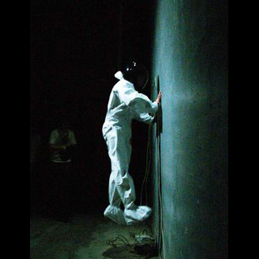
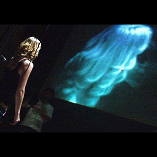

# VIRGO MA 49 - 100/04

VIRGO MA 49-100/04 se presentó en Florencia \(Festival Fabbrica Europa\) y Pisa \(Ipse Dixit\) en mayo y junio de 2006.

VIRGO MA 49 - 100/04 es una performance instalación que se inspira en el sistema de medida de alta precisión "inferómetro láser Virgo", concebido por el Instituto nacional de Física Nuclear \(INFN\) italiano y por el Centro Nacional de Investigaciones Científicas \(CNRS\) francés.

El concepto nuclear del espectáculo es de Emotique: Álvaro Uña y Joan Coll. Participaron los músicos Eraldo Bernocchi, Alessandro Petrillo y Alain Wergifosse. Nicolás Garcia realizó las imágenes proyectadas, Jorge Raedó se encargó de la dramaturgia, Miki Esteban realizó la iluminación y Jordi Torra las fotografías. Isabel Prehuilh diseñó la producción.





## El espectáculo

### vídeos







### fotos

       

## El laboratorio

  

## El viaje

       

## Referencias





