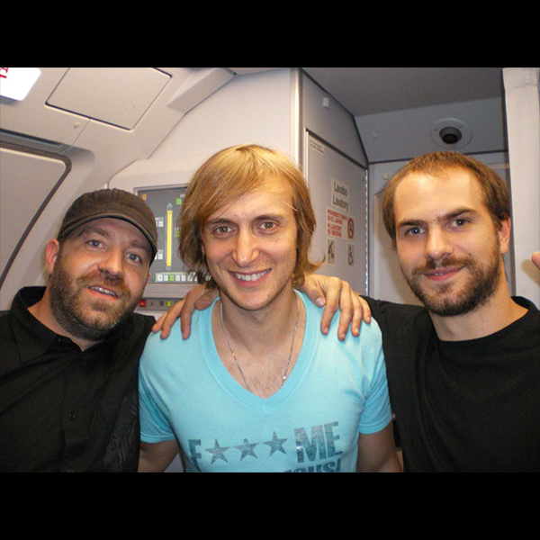

# David Guetta

## David Guetta - La primera discoteca en un avión de pasajeros

Convertimos un Airbus 320 en una discoteca aérea con el DJ francés David Guetta para el vuelo Paris-Ibiza de Vueling. Guetta estuvo tocando 45 minutos para los 180 pasajeros con destino a la isla. Nosotros nos ocupamos de la primera y segunda edición.





