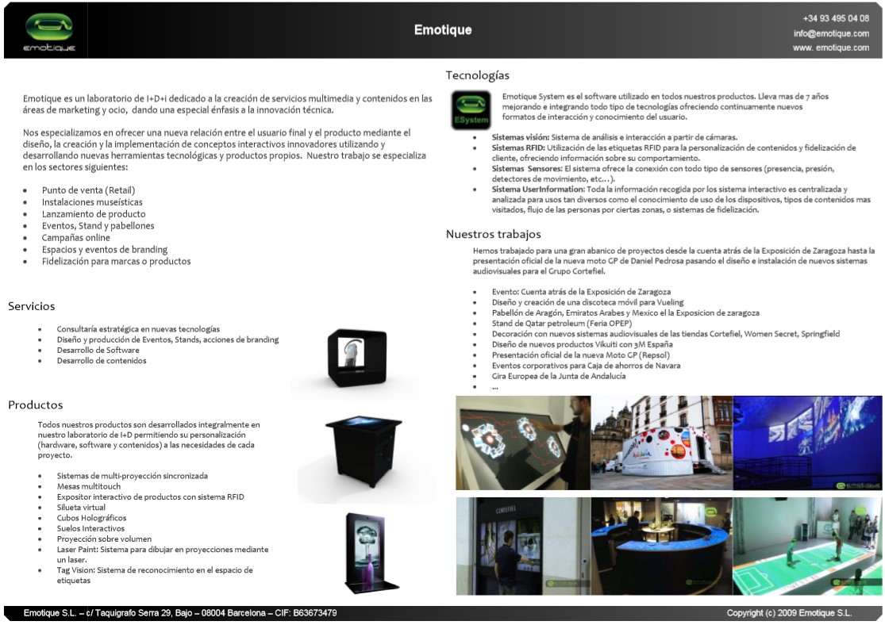
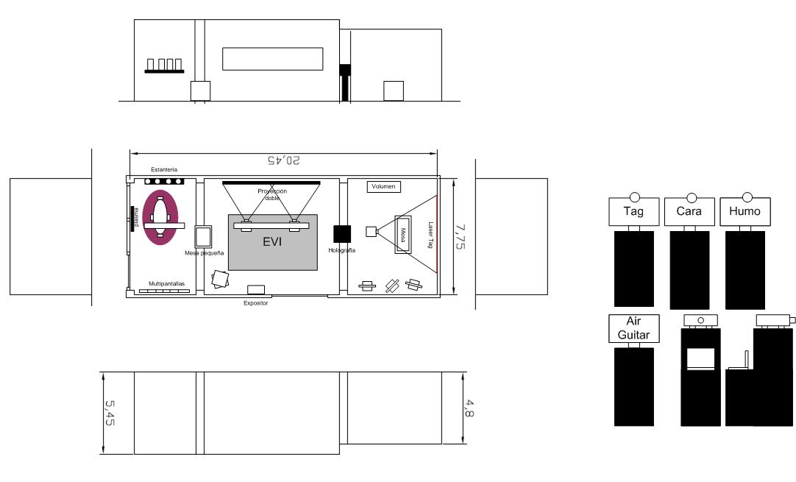

# Emotique SL

## Socios Fundadores

|  |  |  |  |
| :--- | :--- | :--- | :--- |
| Tony Cabello Miguel | Oscar Fernández Barracel | Alvaro Uña Resa | Juan Coll Soler |

## Presentación



## Show Room \(Veribox\)SHOW

## Proyectos Europeos







## Docs

















