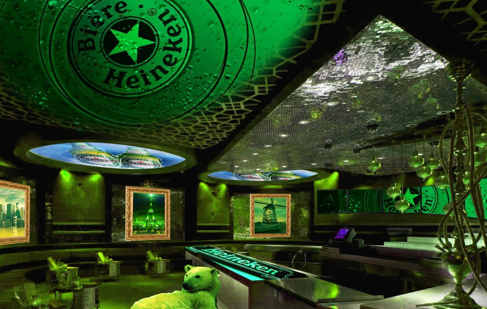

# Projects

## Toyota Experience







## Mesa Eristoff



## Diversabio

Parque de atracciones



## Heineken



## MOVILISTO

Aplicación de poemas para móviles \(en la época del mms\)



## You & I





## ROSQUILLA!



## Tennis



## Shopping Experience \(con Daemon Quest\)



## Cheetos



