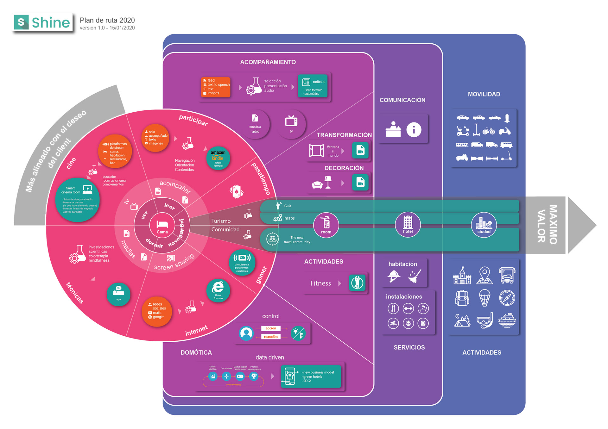
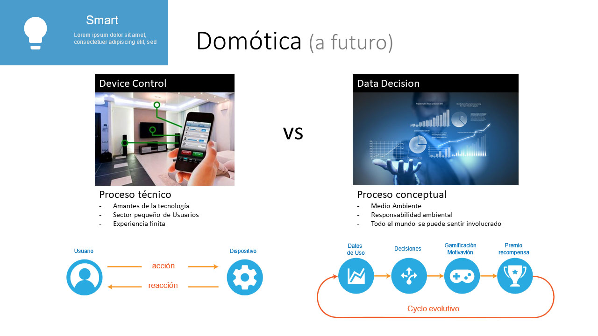
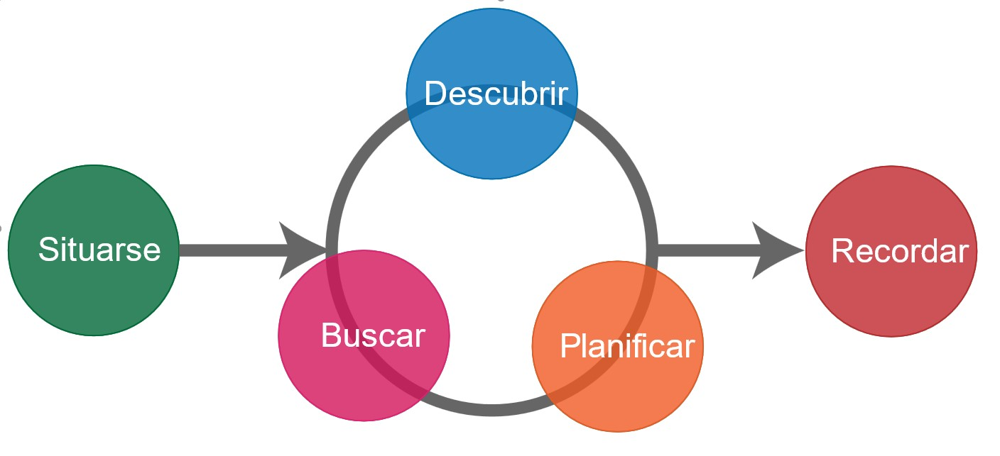
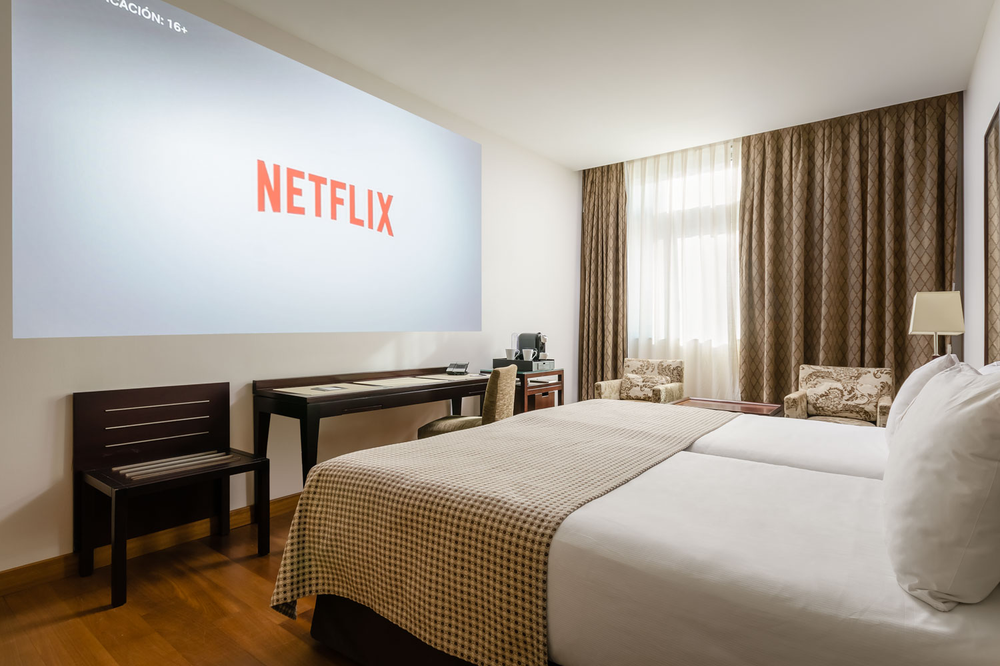
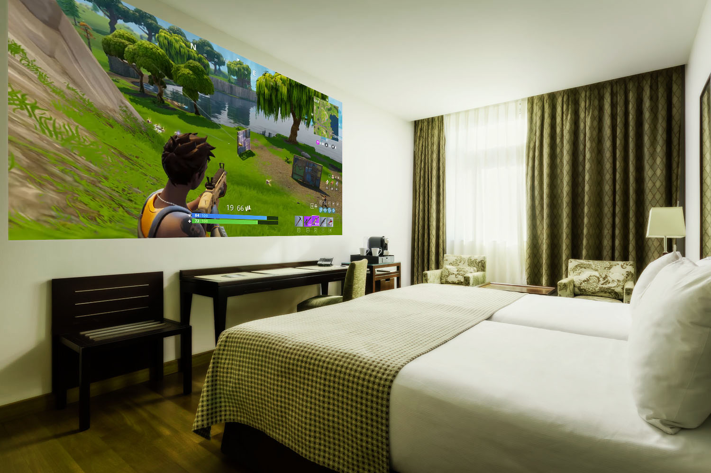
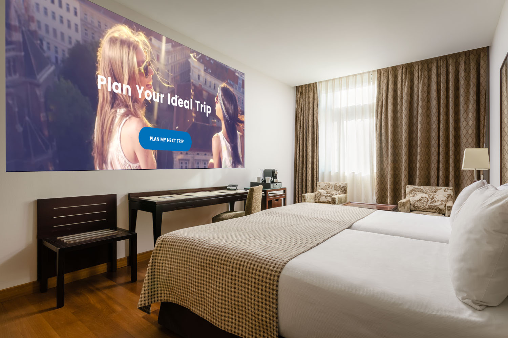
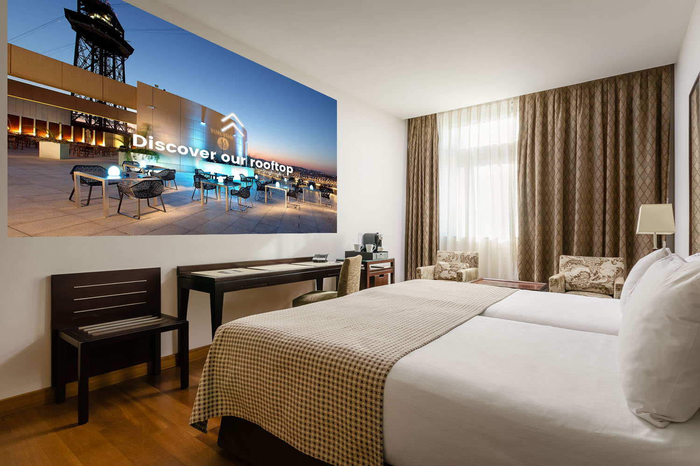

# Next

## NOW \(in development\)







## FUTUR CONCEPTS

### Home Automation

When we talk about automation, we are considering two options with different functionalities and goals.

#### Domotics: device control

We believe that the natural upgrade of the product is to add home automation features.

Since we are able to control the projection system through the app, adding a home automation system to control lighting, climate, entertainment systems, and other appliances would greatly upgrade the experience, bringing the product to a holistic solution.

#### Domotics: data decision

Data decision based automation helps us make decisions related to the use and consumption of the hotels utilities/services. For instance, we could track the amount of the water guests use to raise awareness about water waste and its environmental effect.

### Maps







### Third Party

#### Content Platforms

One of the main requests we got from the surveys and the interviews we did was to introduce Video On Demand service platform. Specifically Netflix, as it is the most VOD service used nowadays. It shows us how important it is to involve third-party service providers.

Room for VOD providers is open, all the main platforms should be accessible through Shine with a direct link.

Shine provides the technical solution and a non-imaginable environment for **a cinema room: the hotel room.** The content is chose by the guests, who normally have their preferences and taste on what they want to watch and when they want to do it.

This option opens a wide range of possibilities for the hotel such as:

New ways and usages for the rooms:

* Events related to cinema comings
* Specific screenings related to hotels
* Up-selling: following the premise that people spend more money for popcorn and sweets than for the entrance, the hotel can create a new range of products focused on the needs Shine will create as:
* New or different products for the Mini-Bar
* Food/Snack packages created specifically for a certain event o as a welcome pack for Shine.

#### Interactive Platforms \(Games\)

Users also would like to see some other features added, gaming applications would make their stay feel truly futuristic and enhanced and would add more interactivity to the experience.

There is a large target who would enjoy the experiences: from kids to gamers who love to enjoy their passions in the less imaginable environments.

### Connectors

In order to provide a full interactive and connected experience, Shine can be connected to different sources of information upon the hotel interests or according to what the guests wish. Also, Shine can be the best and most effective show case.

With this, we are are targeting two strategic goals:

#### Shine as a Showcase

We have the guests attentions in the best possible scenario. A target who is traveling and willing to have the best experience that starts in the hotel room. Shine has already been guiding the guest from the first moment so all commercial information / suggestions should be welcomed.

* Information on main events in city
* Suggested restaurants
* Vouchers for different attractions in the city
* Offers on the spot: hotel services

This is a very flexible approach that can be adapted to the hotels preferences depending on their needs and their communication policy.  
The great format of the screen and the mobile app gives a wide range of possibilities. Emphasizing the projected screen as the main area to display all the information and in all possible digital formats.

Examples:

* Events Information about main events in the city
* Maps A map with a general overview on the main attractions, restaurants and other recommendations

#### Shine as an assistant

we provide information for the guests to have a better overview on their stay and the city they are visiting. Important information that is focused on make their stay easier. Here are few examples:

* Hotel The hotel has a unique app to remotely access the devices Shine has access to all relevant information of the hotel such as check in and check out, breakfast, etc.
* Weather A specific API to show the weather to customers as part of the welcome or general display when shine is on
* Time Same as the weather
* City Relevant information of the city can be displayed when needed. Details about traffic situation, a specific event or any other information that may have an impact on the guests experience in the city
* News Relevant news for guests
* Traffic Traffic information for a better planning of the guests journey
* Economy General overview on economics for guests who are interested in it
* Room In formation about the room as in domotics
* Maps A map with a general overview on the main attractions, restaurants and other recommendations

