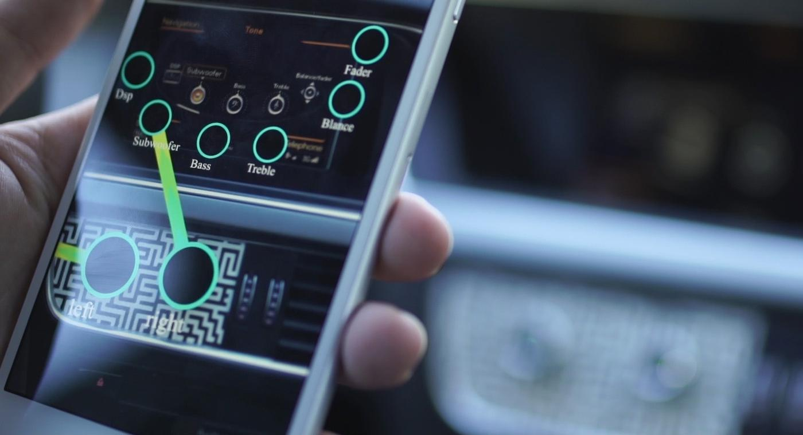

# Nodall concept

Today all services are Web Centralized. But normaly, human experiences are local. I buy in a shop, go to a museum, want food in concrete space/time.  
Time and space are linked to our experiences, but mobile access open often a Global service.  
In a Hotel Room, What if

* We connect mobile to the wall and, a TV Cinema projection apears with all services like tv, share your laptop screen, visit the city, and more \(this is shine\).
* We connect mobile to the fridge and I get the list of drinks I can order.
* We connect mobile to the air conditionaire, and control the temperature.
* We connect mobile to the Clock, and set a new Alarm for tomorrow
* We connect mobile to wardrobe, and can order to clean, or by some new shirt.

### In fact nodall is 

* Distributed Nodes Systems
* **Glocal** Services controled from user mobile.
* Services segmentation in physical Spaces

## Inpiration Source 

### Reality Editor \(MIT\) 

[The main concept](https://www.media.mit.edu/projects/reality-editor/overview/)  of this work group from [Fluid Interface](https://www.media.mit.edu/groups/fluid-interfaces/overview/)  is connect objects from your mobile:

* connect a switch to a light
* connect a volume button to an air conditionaire
* Combine actions in many reactions





