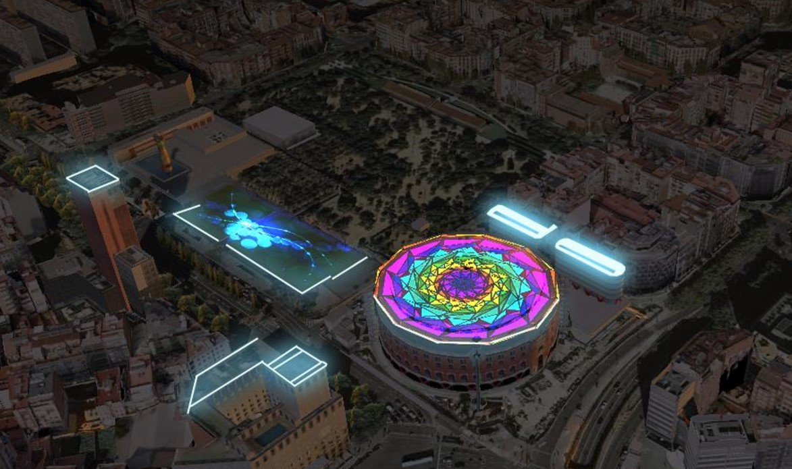
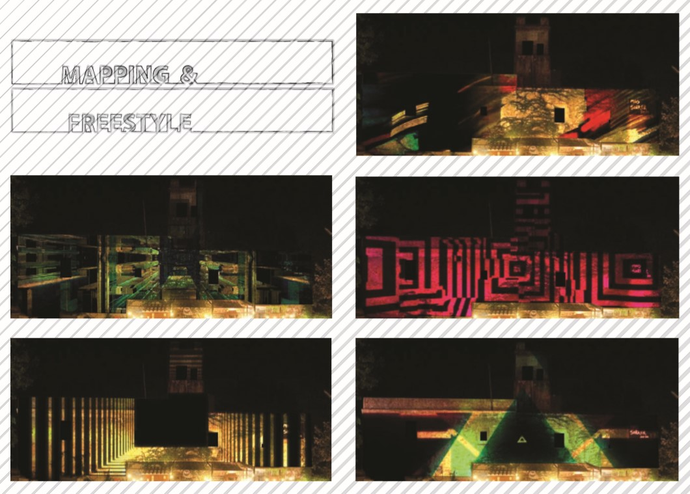

# projects

## EL NACIONAL



## MAGIC BOX



## EL Zeppelin



## INHOTIM





## ZOO XXI



## Ilotis - Baltineis









## BCN Visual



## POCOYO





## FIESP



## MUSEO MASHA

Diseño técnico



## MAPPING REUS



## WORLD MAPPING CHANNEL



## MAPPING MAS SORRER



## ARTte



