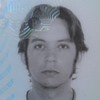
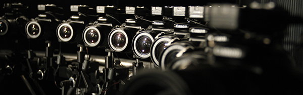
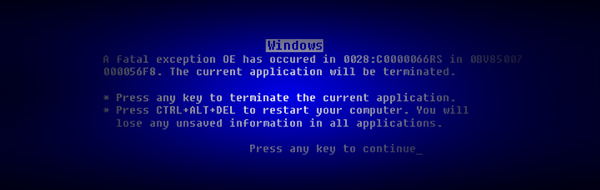
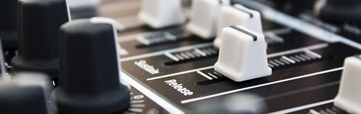
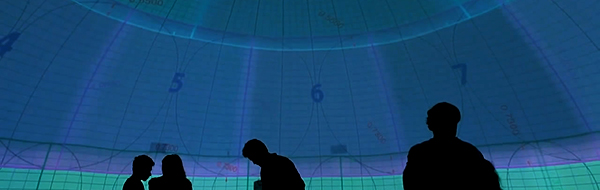
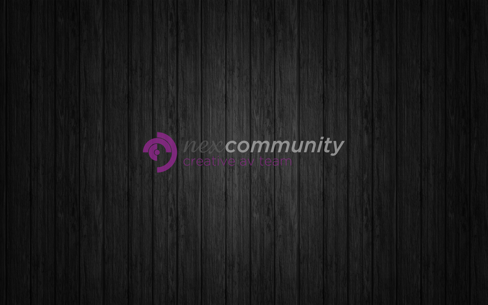
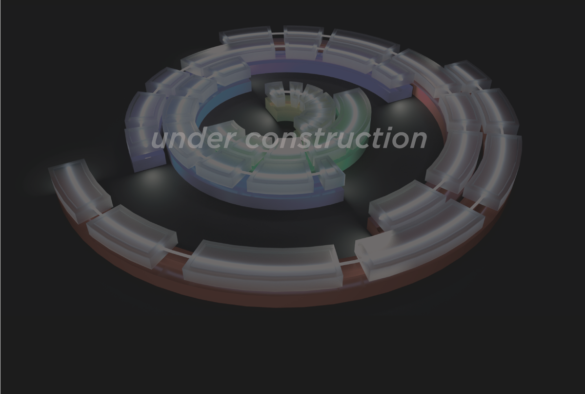
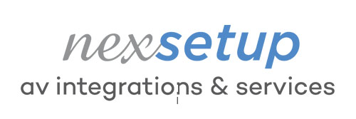
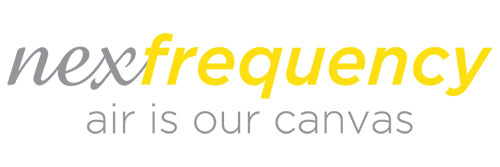
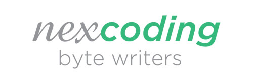

# Nexcommunity SL

## Web



## Reels

### Interactive systems



### Advanced Video Systems



### Mapping



### Video Production



### Virtual Reality



## Socios

|  |  |  |
| :---: | :---: | :---: |
| Tomeu Fiol | Jorge Lopez Lopez-Gay | Juan Coll Soler |

## Equipos

### Vídeo

* Dirección Audiovisual
* Realización y Producción de Vídeo 
* Advanced Video Systems: Proyectos Relacionados con cualquier tipo de grabación o interacción de vídeo: realidad virtual, slow motion, Bullet Time, Drones, etc...

|  | Miquel Angel Raió.jpg | [linkedin](https://www.linkedin.com/in/miquel-%C3%A0ngel-rai%C3%B3-95420961/) |
| :--- | :--- | :--- |
|  | Daniel Marin Viciana | [linkedin](https://www.linkedin.com/in/daniel-marin-viciana-81580540/) |
|  | Ale Marin | [linkedin](https://www.linkedin.com/in/alejandro-martin-ruiz-185882150/) |



### Audio

|  | Pablo Moreno Guerrero | [linkedin](https://www.linkedin.com/in/pablo-moreno-guerrero-44a059a8/) |
| :--- | :--- | :--- |
|  | Manel Ruiz | [instagram](https://www.instagram.com/6tma/?hl=es) |

### Diseño

|  | Marta Mejías Guerrero | [linkedin](https://www.linkedin.com/in/marta-mejias/) |
| :--- | :--- | :--- |
|  | Eduardo Miravalles \(externo pero siempre presente\) | [vamosestudio](http://www.vamosestudio.com/) |

### Técnica

|  | Cayetano Gómez Lucena | [linkedin](https://www.linkedin.com/in/cayetano-g%C3%B3mez-lucena-6745b16a/) |
| :--- | :--- | :--- |
|  | Jorge Lopez Lopez-Gay | [linkedin](https://www.linkedin.com/in/jorge-l%C3%B3pez-l%C3%B3pez-gay-b977103b/) |
|  | Tomeu Fiol | [linkedin](https://www.linkedin.com/in/tomeu-fiol-arguimbau-5ab15a49/) |

### Motion Grafics & 3D

|  | Jorge Alia Olague | [flufa](https://flufa.bandcamp.com/) |
| :--- | :--- | :--- |
|  | Alex Romero | [linkedin](https://www.linkedin.com/in/alex-romero-4149424b/) |

### Programación

|  |  |
| :--- | :--- |
| Pau Vivancos | Juan Coll \(hasta verano 2019\) |

## Docs





## Medias

     

