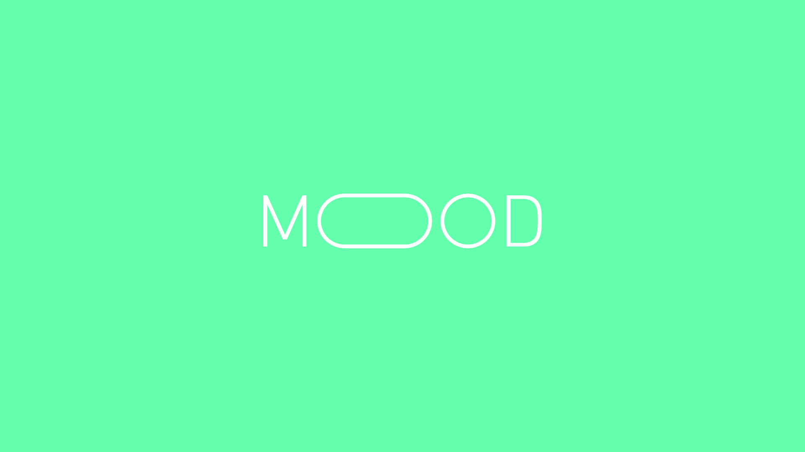
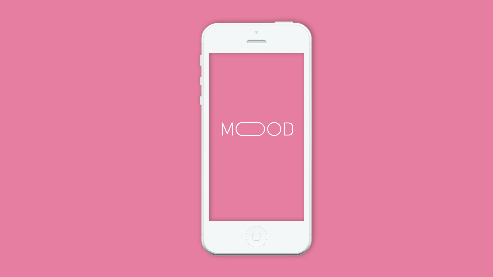

# Graphic Design

autores

* Marta Mejias
* [vamosestudio](http://www.vamosestudio.com/)
* Juan Coll 



## Minimal

## Room



    



      

## Mood V1



             

## Mood V2

                     

## Mood Screens

 

## Mood Full Document



## Tutorial



