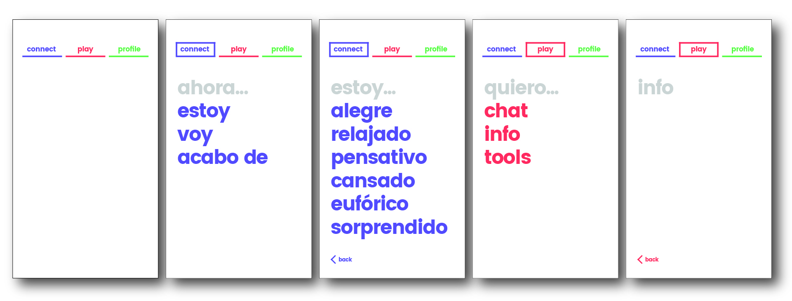
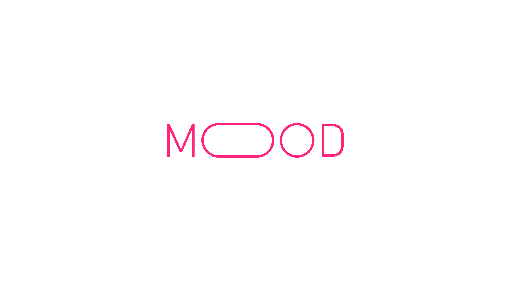
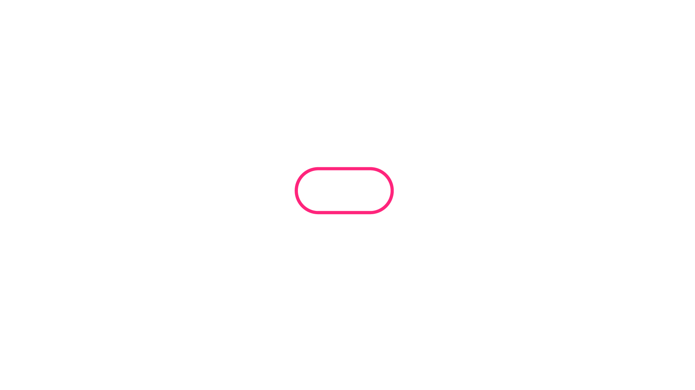

# Graphic Design

autores

* Marta Mejias
* [vamosestudio](http://www.vamosestudio.com/)
* Juan Coll 

## Minimal

## Room

## Mood V1

             

## Mood V2

## Mood Screens

## Mood Dossiers

