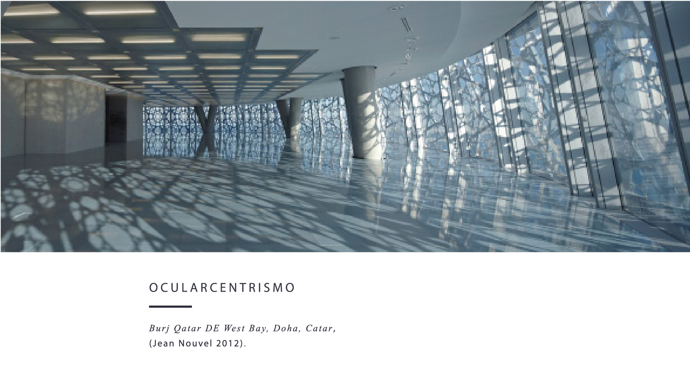
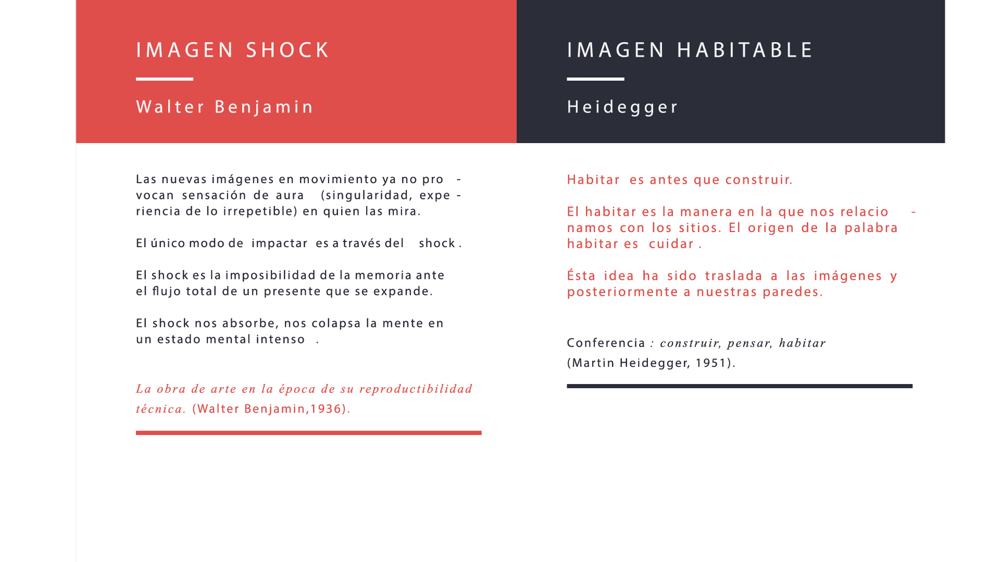
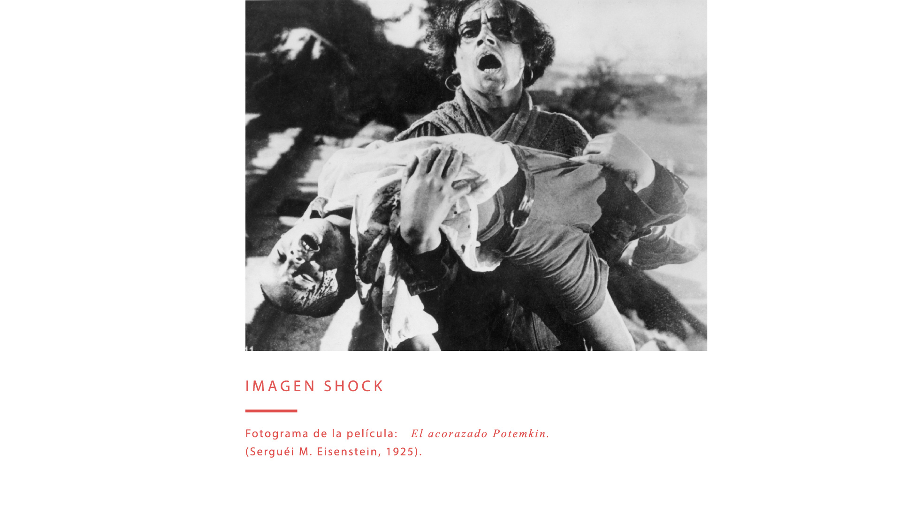
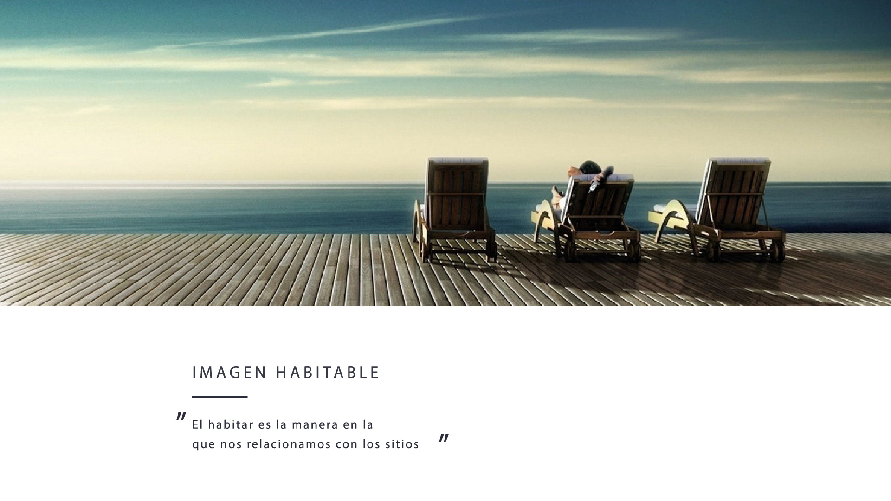
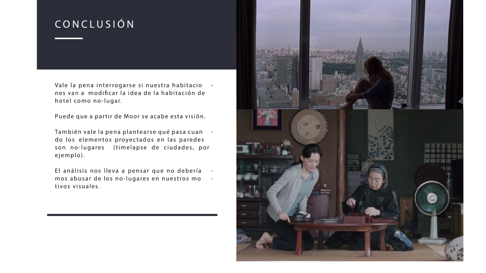

# Theory

Autores

* Miquel Angel Raio \(conceptos\)
* Marta Mejias \(diseño\)

## Contexto

## Dualidades

### Ocularcentrismo / Visión multi-sensorial

### Imagen shock / Imagen habitable

### Lugar / No lugar

