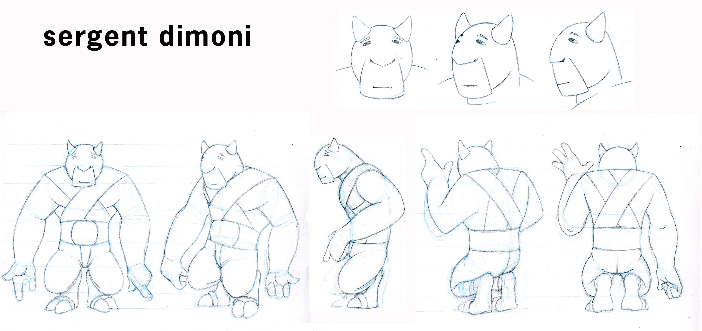

# Precámbrico

## Terra de Dracs

Proyecto para una Serie de Televisión entre la Salle Url, Guillem Bou y Cromosoma.

|  | Creador y director del proyecto | Guillem Bou Bauzà | [linkedin](https://www.linkedin.com/in/guillem-bou-bauz%C3%A0-910a6956/) |
| :--- | :--- | :--- | :--- |









##  **Ventura & Nieto**

## OpenSIM

Proyecto final de la carrera de Ingeniería Multimedia Técnica cursado en la salle. Dirigida por Oscar García \([ver contacto](equipo.md#personas-que-nos-han-acompanado)\). Fue una libreria en C++ para programar sistemas de partículas con múltiples ejemplos.

Karl Sims es una de las personas que más me inspiró y en particular el trabajo siguiente que a día de hoy me sigue pareciendo uno de los trabajo más impresionantes que conozco. El otros grande [Ron Fedkiw](http://physbam.stanford.edu/~fedkiw/) y sus innumerables demos cada una mas impresionante que la otra.



Se implementó la simulación de

* Sistemas eléctricos y gravitacionales  \(a nivel de partículas\)
* Cuerdas elásticas \(como un conjunto de partículas\)
* Cálculo de Colisiones con Triángulos y geometrías complejas como conjunto de triángulos.
* Agua y Ropa como matriz de partículas y muelles 
* Fuego, explosiones y Reconstrucciones de objetos con Campos de Fuerzas en Voxels 





## Docencia

### Asignatura de Física de 1º de Ingeniería Multimedia

#### Cinemática







#### Mecánica





### Diseño de Productos Multimedia

Curso de teoría de la imagen impartido en el Master en Productos Multimedia de LaSalle - Ramon Llull



## Dibujo

### Adolescencia

         

### **Art school**

### Massana

